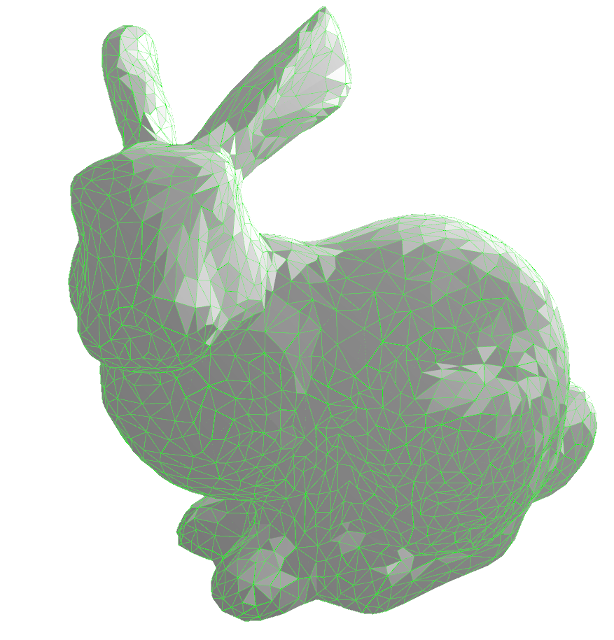
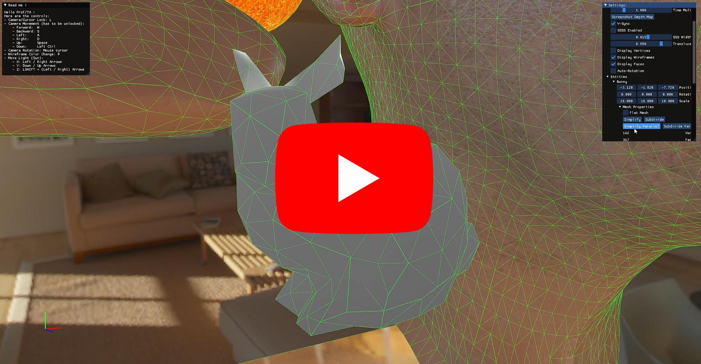

# Final Project of Fundamentals of Computer Graphics: Mesh Subdivision & Simplification / Ray Tracing / Human Skin Rendering

    

# Introduction

For this assignment, the main theme was `Illumination Effect`.

The objectives here were:

1) Load the 3D model, then rotate and zoom it with the mouse or keyboard.

2) Using the combination of object’s material, ambient light, diffuse light and specular light

to generate different illumination effect.

3) All faces have the same color.

Depending on the different calculation ways for normals ("vertex" normal vs "face" normal), you will get a smooth model or a less-smooth one (Figure 1,2,3 vs Figure 4). You only need to implement one of them.

# Compilation

This project and all of my CG projects will be compiled with CMake, if you open the project directly with Visual Studio, you should be able to directly compile it.
Though, as CMake permits it, you will be easily able to compile on other platforms.

# Research

## Mesh Simplification / Subdivision

### Side Notes

[Halfedge Mesh](https://cmu-graphics.github.io/Scotty3D/meshedit/halfedge)

[Loop Subdivision](https://cmu-graphics.github.io/Scotty3D/meshedit/global/loop/)

[Matt's Webcorner](https://graphics.stanford.edu/~mdfisher/subdivision.html)

### Multithreading

Basically, every operations made on this subject have been made processable through multithreading.

If you want to see this part of the code, go in the Mesh_ThreadPool & Mesh_Thread classes.

The multithreading feature gives us access to realtime rendering of the Mesh Simplfication and Subdivision process so that we can observe each step of the Mesh Simplification or Subdivision calculations. Check the demo to see these results.

### Half-Edge

Code available in`OGL_Implementation/Mesh/Mesh_Geometry`class.

To go through the overall structure of a mesh and calculate everything we need, I use what we call a `HalfEdge`structure, its purpose is to locate edges and consider them one side apart from their others, that’s why we call them Half Edges.

The structure is like this:

- Next (halfedge after origin)
- Previous (halfedge before origin)
- Origin (vertex)
- Face
- Twin (opposite halfedge)
- Passed (bool) to indicate in calculations if the half edge should be ignored

Their very purpose will be clarified through the explanation of the Mesh Simplification and the Mesh Subdivision processes.

### Simplification

Code available in`OGL_Implementation/Mesh/Modules/Mesh_Simplification`class.

In this project, Simplification has been made to be rendered in realtime as the changes to the mesh occur.

In order to implement this, multithreading (`<thread>`) was used and Rendering / Mesh Operations are computed one side from another.

The process of Mesh Simplification that has been implemented uses these data and steps:

- Data:
    - Mesh structure (vertices & faces)
    - Half Edges (generated from the Mesh structure)
    - Face Normals
    - Quadric Error Matrices
    - Potential Contracted Points
- Simplification Process:
    1. Retrieve Mesh properties (vertices & faces)
    2. Verify Mesh eligibility to simplification (if it has enough edges)
    3. Initializing new vertices & faces
    4. Generate Half Edges and thus potential pairs to contract
    5. Generate Faces normals: 
    
    $$
    ax + by + cz + d = 0
    $$
    
    1. Generate Q Matrices:
    
    $$
    Q =\sum_{p \in planes} K_p
    $$
    
    $$
    K_p= pp^T=
    \begin{bmatrix} 
    a² & ab & ac & ad \\ 
    ba & b² & bc & bd \\ 
    ca & cb & c² & cd \\
    da & db & dc & d²
    \end{bmatrix}
    $$
    
    1. Calculate Contracted Point (4 ways to do so but only the 1st option is being used for runtime speed purposes):
        
        $$
        ContractedPoint1=\frac{v_1+v_2}{2}
        $$
        
    
    $$
    ContractedPoint2=v_1
    $$
    
    $$
    ContractedPoint3=v_2
    $$
    
    $$
    ContractedPoint4=
    \begin{bmatrix} 
    q_{11} & q_{12} & q_{13} & q_{14} \\ 
    q_{21} & q_{22} & q_{23} & q_{24} \\ 
    q_{31} & q_{32} & q_{33} & q_{34} \\
    0 & 0 & 0 & 1
    \end{bmatrix}^{-1}
    \begin{bmatrix} 
    0 \\ 
    0 \\ 
    0 \\
    1
    \end{bmatrix}
    $$
    
    1. Calculate each pair of Quadric Error Metrics / HalfEdge(pair of vertices) and sort them in increasing order in a `std::map`
    
    $$
    \bar{Q}=\bar{v}^T(Q_1+Q_2)\bar{v}
    $$
    
    $$
    \bar{v}=ContractedPoint
    $$
    
    1. Take Lowest Quadric Error Metric and its associated HalfEdge and contract the edge
    2. Update new Face Normals, Q Matrices and Quadric Error Metrics.
    3. Repeat Steps 9 and 10 until simplified enough.

And that gives us this kind of results, keep in mind that my simplification stops at ~half the number of faces it had at the beginning (you can check out the recording `2021400603_Project_Recording_Simplification.mp4`or code for better understanding):

- Normal Mesh (2503 vertices, 4968 faces):

- 1x Simplified Mesh (1253 vertices, 2483 faces) in 2.542 seconds:

- 2x Simplified Mesh (627 vertices, 1240 faces) in 3.014 seconds:

- 3x Simplified Mesh (315 vertices, 620 faces) in 3.129 seconds:

- 4x Simplified Mesh (157 vertices, 309 faces) in 3.153 seconds:

- 5x Simplified Mesh (79 vertices, 153 faces) in 3.159 seconds:

### Subdivision

Code available in`OGL_Implementation/Mesh/Modules/Mesh_Subdivision`class.

In this project, Subdivision has been made to be rendered in realtime as the changes to the mesh occur.

In order to implement this, multithreading (`<thread>`) was used and Rendering / Mesh Operations are computed one side from another.

The process of Mesh Subdivision that has been implemented uses these data and steps:

- Data:
    - Mesh structure (vertices & faces)
    - Half Edges (generated from the Mesh structure)
- Subdivision process:
    1. Retrieve Mesh properties (vertices & faces)
    2. Initialize set of new faces and vertices:
        1. New faces start empty.
        2. New vertices start with the original ones.
    3. Generate Half Edges
    4. Create new vertices based on their neighbours positions.
        1. Take a Half Edge and create a vertex between the 2 points of this half edge
        2. Calculate final position of the new vertex based on its neighbours
            - Normal Case: The new vertex (blue) will be equal to a weighted average of the neighbors old vertices (red)
            
            $$
            v=\frac{1}{8}\left(a+b\right)+\frac{3}{8}\left(c+d\right)
            $$
            
            
            
            - Boundary Case: The new vertex (blue) will be equal to half of both neighbour vertices, as if it belongs to the line between these 2 neighbour points.
            
            $$
            v=\frac{1}{2}\left(a+b\right)
            $$
            
            
            
        3. Assign the vertex to the Half Edge’s twin to avoid duplicates
    5. Link old & new vertices to form new faces.
    6. Calculate the new positions of the old vertices.
        - Normal case: The new position of the old vertex (blue) will be a weighted average of every old neighbour vertices (red).
        
        $$
        n=\text{count of neighbour positions}
        $$
        
        $$
        \beta= \begin{cases}
        \frac{3}{8n} & n >3 \\
        \frac{3}{16} & n = 3
        \end{cases}
        $$
        
        $$
        v=(1-n\beta)*v_{old} +\beta*\sum{v_{neighbours}}
        $$
        
        
        
        - Boundary case: The new vertex will be equal to an eighth of both neighbour vertices added to 3 quarters of its old position
        
        $$
        v=\frac{1}{8}\left(a+b\right)+\frac{3}{4}\left(v_{old}\right)
        $$
        
        
        

And that gives us this kind of results, keep in mind that my simplification stops at ~half the number of faces it had at the beginning (you can check out the recording `2021400603_Project_Recording_Subdivision.mp4`or code for better understanding):

- Normal Mesh (2503 vertices, 4968 faces):

- 1x Subdivided Mesh (9976 vertices, 19872 faces) in 1.977 seconds:

- 2x Subdivided Mesh (39826 vertices, 79488 faces) in 103.988 seconds:

- Icosahedron subdivided 2 times:

# Demonstration

## Content

For my Assignment, I got all these points covered:

- Mesh Subdivision implemented with the Loop Subdivision Method
- Mesh Simplification implemented with the Quadric Error Metrics method
- Bonus:
    - Display Mode (Vertices, Wireframe, Faces)
    - Enable/Disable GUI
    - X,Y,Z axis are displayed (in the bottom-left corner) to know where the models movement will occur
    - Mesh Simplification/Subdivision is multithreaded, so the process can be seen in realtime
    - Almost all properties of entities/mesh... are editable

## How to use it

You can launch the `FinalProject.exe`directly, if you already have Visual C++ Redistribuable.

The program was compiled in Release mode.

As it is displayed in the program, here are the controls by order of priority for the assignment:

## Controls

- Enable/Disable GUI: T
- Wireframe Color Change: P
- Camera/Cursor Lock: L
- Change Display Mode: C
- Light Movement:
    - X : ⬅️➡️
    - Y: ⬆️ ⬇️
    - Z: LSHIFT + ⬅️➡️
- Camera Movement:
    - Forward: W (or Z on AZERTY layout)
    - Backward: S
    - Left: A (or Q on AZERTY layout)
    - Right: D
    - Up: Space
    - Down: Left CTRL

## Additional Interactions

- You can change the Display Mode on the `Display Mode`menu.
- You can change the FPS cap/limit
- You can set/unset Auto-Rotation
- You can change the Time multiplier (multiplies deltaTime)
- You can change parameters related to lights & entities in the GUI

# Code Architecture

The Complete Documentation is available in the project, in the Code Architecture part will only be explained a small description of what classes do.

## Documentation

There is a documentation available [here](https://kevinpruvost.github.io/ComputerGraphics_FinalProject/) or in `docs/index.html` if you want to have a better view on the classes I made.

