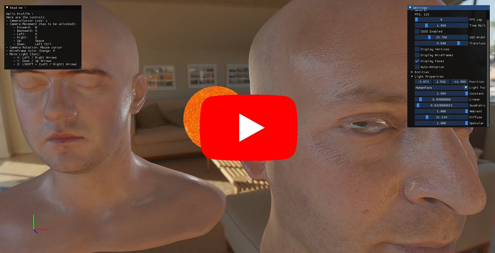

# Final Project of Fundamentals of Computer Graphics: Mesh Subdivision & Simplification / Human Skin Rendering

<p align="center">
  <br/><br/>
</p>

Table of contents
=================

<!--ts-->
   * [Introduction](#introduction)
   * [Demonstration](#demonstration)
      * [Mesh Simplification](#mesh-simplification-demo)
      * [Mesh Subdivision](#mesh-simplification-demo)
      * [Human Skin Rendering](#human-skin-rendering-demo)
   * [Compilation](#compilation)
   * [Research](#research)
      * [Mesh Subdivision/Simplification](#mesh-simplification-and-subdivision)
      * [Human Skin Rendering](#human-skin-rendering)
   * [Content](#content)
   * [How to use it](#how-to-use-it)
   * [Controls](#controls)
   * [Additional Interactions](#additional-interactions)
   * [Code Architecture](#code-architecture)
      * [Documentation](#documentation)
<!--te-->

# Introduction

For the final project, we had a choice to make: "Select a given subject among a list of 6 and work/conduct research on that subject".
And the 6 choices we had were:
- Mesh Simplification/Subdivision
- Terrain Engine
- Rubik's Cube
- Physical Engine
- Ray Tracing
- Human Skin Rendering

As I wanted to learn a lot of technical notions and make my time efficient for such learning purposes, I went on to work on "Mesh Simplification/Subdivision" and "Human Skin Rendering" as my main subjects, I also worked a bit on "Ray Tracing" but my work is not complete and available on another repository.

So, my objectives here were:
- Implement Mesh Simplification using Quadric Error Metrics
- Implement Mesh Subdivision using the Loop Subdivision Method
- Implement Shadow Rendering
- Implement Physically Based Rendering
- Implement Separable Subsurface Scattering

# Demonstration

## Mesh Simplification Demo

[](https://youtu.be/MHmWF2G7UVo)

## Mesh Subdivision Demo

[](https://youtu.be/6dZ_UqkRjvs)

## Human Skin Rendering Demo

[](https://youtu.be/uB3GbnD7i_4)

# Compilation

This project and all of my CG projects will be compiled with CMake, if you open the project directly with Visual Studio, you should be able to directly compile it.
Though, as CMake permits it, you will be easily able to compile on other platforms.

# Research

## Mesh Simplification and Subdivision

### Side Notes

[Halfedge Mesh - Carneggie Mellon University Scotty3D](https://cmu-graphics.github.io/Scotty3D/meshedit/halfedge)

[Loop Subdivision - Carneggie Mellon University Scotty3D](https://cmu-graphics.github.io/Scotty3D/meshedit/global/loop/)

[Mesh Simplification - Carneggie Mellon University Scotty3D](https://cmu-graphics.github.io/Scotty3D/meshedit/global/simplify/)

[Matt's Webcorner - Stanford University](https://graphics.stanford.edu/~mdfisher/subdivision.html)

### Multithreading

Basically, every operations made on this subject have been made processable through multithreading.

If you want to see this part of the code, go in the Mesh_ThreadPool & Mesh_Thread classes.

The multithreading feature gives us access to realtime rendering of the Mesh Simplfication and Subdivision process so that we can observe each step of the Mesh Simplification or Subdivision calculations. Check the demo to see these results.

### Half-Edge

Code available in`OGL_Implementation/Mesh/Mesh_Geometry`class.

To go through the overall structure of a mesh and calculate everything we need, I use what we call a `HalfEdge`structure, its purpose is to locate edges and consider them one side apart from their others, that’s why we call them Half Edges.

The structure is like this:

- Next (halfedge after origin)
- Previous (halfedge before origin)
- Origin (vertex)
- Face
- Twin (opposite halfedge)
- Passed (bool) to indicate in calculations if the half edge should be ignored

Their very purpose will be clarified through the explanation of the Mesh Simplification and the Mesh Subdivision processes.

### Simplification

Code available in`OGL_Implementation/Mesh/Modules/Mesh_Simplification`class.

In this project, Simplification has been made to be rendered in realtime as the changes to the mesh occur.

In order to implement this, multithreading (`<thread>`) was used and Rendering / Mesh Operations are computed one side from another.

The process of Mesh Simplification that has been implemented uses these data and steps:

- Data:
    - Mesh structure (vertices & faces)
    - Half Edges (generated from the Mesh structure)
    - Face Normals
    - Quadric Error Matrices
    - Potential Contracted Points
- Simplification Process:
    1. Retrieve Mesh properties (vertices & faces)
    2. Verify Mesh eligibility to simplification (if it has enough edges)
    3. Initializing new vertices & faces
    4. Generate Half Edges and thus potential pairs to contract
    5. Generate Faces normals: 
    
    $$
    ax + by + cz + d = 0
    $$
    
    1. Generate Q Matrices:
    
    $$
    Q =\sum_{p \in planes} K_p
    $$
    
    $$
    K_p= pp^T=
    \begin{bmatrix} 
    a² & ab & ac & ad \\ 
    ba & b² & bc & bd \\ 
    ca & cb & c² & cd \\
    da & db & dc & d²
    \end{bmatrix}
    $$
    
    1. Calculate Contracted Point (4 ways to do so but only the 1st option is being used for runtime speed purposes):
        
        $$
        ContractedPoint1=\frac{v_1+v_2}{2}
        $$
        
    
    $$
    ContractedPoint2=v_1
    $$
    
    $$
    ContractedPoint3=v_2
    $$
    
    $$
    ContractedPoint4=
    \begin{bmatrix} 
    q_{11} & q_{12} & q_{13} & q_{14} \\ 
    q_{21} & q_{22} & q_{23} & q_{24} \\ 
    q_{31} & q_{32} & q_{33} & q_{34} \\
    0 & 0 & 0 & 1
    \end{bmatrix}^{-1}
    \begin{bmatrix} 
    0 \\ 
    0 \\ 
    0 \\
    1
    \end{bmatrix}
    $$
    
    1. Calculate each pair of Quadric Error Metrics / HalfEdge(pair of vertices) and sort them in increasing order in a `std::map`
    
    $$
    \bar{Q}=\bar{v}^T(Q_1+Q_2)\bar{v}
    $$
    
    $$
    \bar{v}=ContractedPoint
    $$
    
    1. Take Lowest Quadric Error Metric and its associated HalfEdge and contract the edge
    2. Update new Face Normals, Q Matrices and Quadric Error Metrics.
    3. Repeat Steps 9 and 10 until simplified enough.

And that gives us this kind of results, keep in mind that my simplification stops at ~half the number of faces it had at the beginning (you can check out the recording `2021400603_Project_Recording_Simplification.mp4`or code for better understanding):

- Normal Mesh (2503 vertices, 4968 faces):


- 1x Simplified Mesh (1253 vertices, 2483 faces) in 2.542 seconds:


- 2x Simplified Mesh (627 vertices, 1240 faces) in 3.014 seconds:


- 3x Simplified Mesh (315 vertices, 620 faces) in 3.129 seconds:


- 4x Simplified Mesh (157 vertices, 309 faces) in 3.153 seconds:


- 5x Simplified Mesh (79 vertices, 153 faces) in 3.159 seconds:


### Subdivision

Code available in`OGL_Implementation/Mesh/Modules/Mesh_Subdivision`class.

In this project, Subdivision has been made to be rendered in realtime as the changes to the mesh occur.

In order to implement this, multithreading (`<thread>`) was used and Rendering / Mesh Operations are computed one side from another.

The process of Mesh Subdivision that has been implemented uses these data and steps:

- Data:
    - Mesh structure (vertices & faces)
    - Half Edges (generated from the Mesh structure)
- Subdivision process:
    1. Retrieve Mesh properties (vertices & faces)
    2. Initialize set of new faces and vertices:
        1. New faces start empty.
        2. New vertices start with the original ones.
    3. Generate Half Edges
    4. Create new vertices based on their neighbours positions.
        1. Take a Half Edge and create a vertex between the 2 points of this half edge
        2. Calculate final position of the new vertex based on its neighbours
            - Normal Case: The new vertex (blue) will be equal to a weighted average of the neighbors old vertices (red)
            
            $$
            v=\frac{1}{8}\left(a+b\right)+\frac{3}{8}\left(c+d\right)
            $$
            
            
            
            - Boundary Case: The new vertex (blue) will be equal to half of both neighbour vertices, as if it belongs to the line between these 2 neighbour points.
            
            $$
            v=\frac{1}{2}\left(a+b\right)
            $$
            
            
            
        3. Assign the vertex to the Half Edge’s twin to avoid duplicates
    5. Link old & new vertices to form new faces.
    6. Calculate the new positions of the old vertices.
        - Normal case: The new position of the old vertex (blue) will be a weighted average of every old neighbour vertices (red).
        
        $$
        n=\text{count of neighbour positions}
        $$
        
        $$
        \beta= \begin{cases}
        \frac{3}{8n} & n >3 \\
        \frac{3}{16} & n = 3
        \end{cases}
        $$
        
        $$
        v=(1-n\beta)*v_{old} +\beta*\sum{v_{neighbours}}
        $$
        
        
        
        - Boundary case: The new vertex will be equal to an eighth of both neighbour vertices added to 3 quarters of its old position
        
        $$
        v=\frac{1}{8}\left(a+b\right)+\frac{3}{4}\left(v_{old}\right)
        $$
        
        
        

And that gives us this kind of results, keep in mind that my simplification stops at ~half the number of faces it had at the beginning (you can check out the recording `2021400603_Project_Recording_Subdivision.mp4`or code for better understanding):

- Normal Mesh (2503 vertices, 4968 faces):


- 1x Subdivided Mesh (9976 vertices, 19872 faces) in 1.977 seconds:


- 2x Subdivided Mesh (39826 vertices, 79488 faces) in 103.988 seconds:


- Icosahedron subdivided 2 times:


## Human Skin Rendering

### Side Notes

[Jorge Jimenez - Report on Separable SSS](http://www.iryoku.com/separable-sss/downloads/Separable-Subsurface-Scattering.pdf)

[Jorge Jimenez - Blog Post on Separable SSS](http://www.iryoku.com/separable-sss/)

[GitHub - iryoku/separable-sss: Separable Subsurface Scattering is a technique that allows to efficiently perform subsurface scattering calculations in screen space in just two passes.](https://github.com/iryoku/separable-sss)

[Shadow Mapping](https://learnopengl.com/Advanced-Lighting/Shadows/Shadow-Mapping)

[Theory](https://learnopengl.com/PBR/Theory)

### Shadow Rendering

Rendering shadows is done via Shadow Mapping, a depth map is generated from the view of the light source and stored in a texture for the Shadow Rendering to occur.

For this project, only directional lights with orthogonal projections are supported.

After the Shadow Mapping is done, the shader that renders the objects in the main pipeline retrieves the Depth Maps and calculates the shadows positions from there.


Shadows in this project are calculated considering the Depth Map and the vertex depth from the light source’s point of view. A bias is applied to fix the shadows appearance (to make it not look like shadow strides). But also, multisampling (5 samples) is used to smooth out the shadows edges so that it doesn’t appear pixelated.


Here’s the whole calculation if you want further analysis of the method:

```glsl
float ShadowCalculation(vec4 fragPosLightSpace, sampler2D shadowMap, vec3 lightPos)
{
    // perform perspective divide
    vec3 projCoords = fragPosLightSpace.xyz / fragPosLightSpace.w;
    // transform to [0,1] range
    projCoords = projCoords * 0.5 + 0.5;
    // get closest depth value from light's perspective (using [0,1] range fragPosLight as coords)
    float closestDepth = texture(shadowMap, projCoords.xy).r; 
    // get depth of current fragment from light's perspective
    float currentDepth = projCoords.z;
    // calculate bias (based on depth map resolution and slope)
    vec3 normal = normalize(Normal);
    vec3 lightDir = normalize(lightPos - WorldPos);
    float bias = max(0.05 * (1.0 - dot(normal, lightDir)), 0.005);
    // check whether current frag pos is in shadow
    // PCF
    int samples = 5;
    int offset = (samples - 1) / 2;
    float shadow = 0.0;
    vec2 texelSize = 1.0 / textureSize(shadowMap, 0);
    for(int x = -offset; x <= offset; ++x)
    {
        for(int y = -offset; y <= offset; ++y)
        {
            float pcfDepth = texture(shadowMap, projCoords.xy + vec2(x, y) * texelSize).r; 
            shadow += currentDepth - bias > pcfDepth ? 1.0 : 0.0;        
        }
    }
    shadow /= samples * samples;
    
    // keep the shadow at 0.0 when outside the far_plane region of the light's frustum.
    if(projCoords.z > 1.0)
        shadow = 0.0;
        
    return shadow;
}
```

### Physically Based Rendering (PBR)

Implementation of PBR in this project solely consists of using material maps such as:

- Ambient Occlusion
- Diffuse Albedo
- Specular Albedo
- Metallic
- Roughness

And using all theory actually displayed and very well explained in JoeyDeVries’ tutorial on PBR:

[Theory](https://learnopengl.com/PBR/Theory)


### Separable Subsurface Scattering

Implementation of Separable Subsurface Scattering is a bit special in this project as it has been a little bit rushed.

Basically, Transmittance has been implemented but not proper Blur function as advised in Jorge Jimenez’s paper & example repository.

Instead, to get a good result but also to implement it faster I made Subsurface Scattering to be just Transmittance with Multisampling (17 samples) so that it gives this kind of result:


Separable SSS is added in the original shader there:

```glsl
if (ssssEnabled)
{ 
    vec3 light = pointLights[i].position - WorldPos;
    light = light / length(light);
    vec3 transmittance = CalculateTransmittance(translucency, sssWidth, WorldPos, normalize(Normal), light, shadowMapsPerPointLight[i], pointLights[i].spaceMatrix, pointLights[i].farPlane);
    Lo += albedo * radiance * transmittance;
}
```

And the transmittance is calculated like so (reference to Jorge Jimenez example repository):

```glsl
float3 SSSSTransmittance(
        /**
         * This parameter allows to control the transmittance effect. Its range
         * should be 0..1. Higher values translate to a stronger effect.
         */
        float translucency,

        /**
         * This parameter should be the same as the 'SSSSBlurPS' one. See below
         * for more details.
         */
        float sssWidth,

        /**
         * Position in world space.
         */
        float3 worldPosition,

        /**
         * Normal in world space.
         */
        float3 worldNormal,

        /**
         * Light vector: lightWorldPosition - worldPosition.
         */
        float3 light,

        /**
         * Linear 0..1 shadow map.
         */
        SSSSTexture2D shadowMap,

        /**
         * Regular world to light space matrix.
         */
        float4x4 lightViewProjection,

        /**
         * Far plane distance used in the light projection matrix.
         */
        float lightFarPlane) {
    /**
     * Calculate the scale of the effect.
     */
    float scale = 8.25 * (1.0 - translucency) / sssWidth;
       
    /**
     * First we shrink the position inwards the surface to avoid artifacts:
     * (Note that this can be done once for all the lights)
     */
    float4 shrinkedPos = float4(worldPosition - max(0.05 * (1.0 - dot(light, -worldNormal)), 0.005) * worldNormal, 1.0);
    shrinkedPos = float4(worldPosition - 0.005 * worldNormal, 1.0);

    /**
     * Now we calculate the thickness from the light point of view:
     */
    float4 sPos = SSSSMul(shrinkedPos, lightViewProjection);
    float3 shadowPosition = sPos.xyz / sPos.w;
    shadowPosition = SSSSMul(shadowPosition, 0.5) + 0.5;
    vec3 finalColor = vec3(0.0);

    int samples = 17;
    int offset = (samples - 1) / 2;
    vec2 texelSize = 1.0 / textureSize(shadowMap, 0);
    float d2 = shadowPosition.z * lightFarPlane;
    for (int x = -offset; x <= offset; ++x)
    {
        for (int y = -offset; y <= offset; ++y)
        {
            float d1 = SSSSSample(shadowMap, shadowPosition.xy + vec2(x, y) * texelSize).r; // 'd1' has a range of 0..1
            d1 *= lightFarPlane; // So we scale 'd1' accordingly:
            if (d1 == d2) continue;
            float d = scale * abs(d1 - d2);

            /**
             * Armed with the thickness, we can now calculate the color by means of the
             * precalculated transmittance profile.
             * (It can be precomputed into a texture, for maximum performance):
             */
            float dd = -d * d;
            float3 profile = float3(0.233, 0.455, 0.649) * exp(dd / 0.0064) +
                float3(0.1, 0.336, 0.344) * exp(dd / 0.0484) +
                float3(0.118, 0.198, 0.0) * exp(dd / 0.187) +
                float3(0.113, 0.007, 0.007) * exp(dd / 0.567) +
                float3(0.358, 0.004, 0.0) * exp(dd / 1.99) +
                float3(0.078, 0.0, 0.0) * exp(dd / 7.41);

            /**
             * Using the profile, we finally approximate the transmitted lighting from
             * the back of the object:
             */
            finalColor += profile * SSSSSaturate(0.3 + dot(light, -worldNormal));
        }
    }
    finalColor /= samples * samples;
    return finalColor;
}
```

# Content

For my project, I got all these points covered:

- Mesh Subdivision implemented with the Loop Subdivision Method
- Mesh Simplification implemented with the Quadric Error Metrics method
- Shadow Rendering
- Physically Based Rendering
- Separable Subsurface Scattering
- Bonus:
    - Display Mode (Vertices, Wireframe, Faces)
    - Enable/Disable GUI
    - X,Y,Z axis are displayed (in the bottom-left corner) to know where the models movement will occur
    - Mesh Simplification/Subdivision is multithreaded, so the process can be seen in realtime
    - Almost all properties of entities/mesh... are editable

# How to use it

You can launch the `FinalProject.exe`directly, if you already have Visual C++ Redistribuable.

The program was compiled in Release mode.

As it is displayed in the program, here are the controls by order of priority for the assignment:

# Controls

- Enable/Disable GUI: T
- Wireframe Color Change: P
- Camera/Cursor Lock: L
- Change Display Mode: C
- Light Movement:
    - X : ⬅️➡️
    - Y: ⬆️ ⬇️
    - Z: LSHIFT + ⬅️➡️
- Camera Movement:
    - Forward: W (or Z on AZERTY layout)
    - Backward: S
    - Left: A (or Q on AZERTY layout)
    - Right: D
    - Up: Space
    - Down: Left CTRL

# Additional Interactions

- You can change the Display Mode on the `Display Mode`menu.
- You can change the FPS cap/limit
- You can set/unset Auto-Rotation
- You can change the Time multiplier (multiplies deltaTime)
- You can change parameters related to lights & entities in the GUI

# Code Architecture

The Complete Documentation is available in the project, in the Code Architecture part will only be explained a small description of what classes do.

## Documentation

There is a documentation available [here](https://kevinpruvost.github.io/ComputerGraphics_FinalProject/) or in `docs/index.html` if you want to have a better view on the classes I made.

